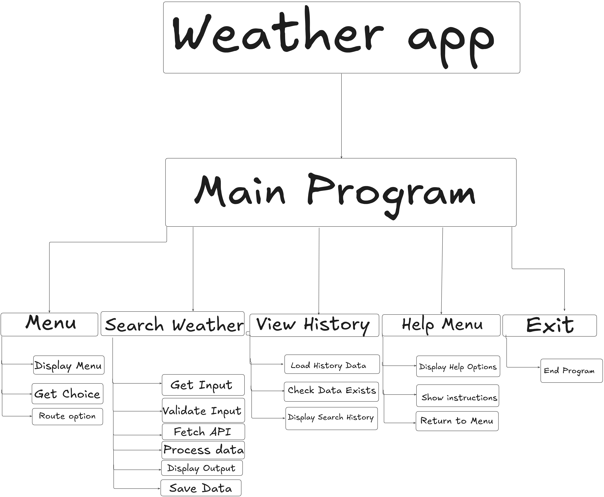
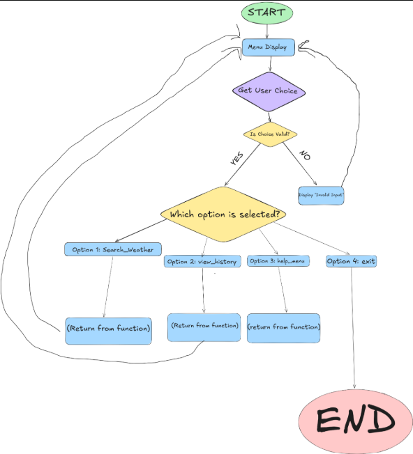

# Requirements Definition 

## Purpose of the System 

### What my application does  
My app uses an API to provide the user with weather information for any city around the world. It also logs previous searches so users can refer back to them if needed.  

### Who is it for  
My application targets individuals who want quick and simple weather information from a trusted source, without ads or distracting content.  

---

# Functional Requirements 

## User Actions

- The system must allow the user to enter a city name.  
- The system must allow the user to view previous searches.  
- The system must allow the user to exit the application safely without errors.  
- The system must allow the user to access a help menu at any time.  

---

## System Behaviour 

- The system must retrieve weather data from an external API based on user input.  
- The system must display temperature, humidity, and weather description clearly in the console.  
- The system must store user search data in a CSV file using the Pandas library.  

---

## Error Handling

- The help menu must guide users through common errors such as:
  - Invalid city name  
  - No internet connection  
  - API not responding  

- The system must handle invalid input and API errors without crashing. For example:
  - Use try and except to handle user input errors  
  - Evaluate API response status codes (e.g. 200 = success, 404 = not found)  

- The system must display appropriate error messages to guide the user.  

---

## Help Menu 

- The help menu must be accessible at any time if the user needs assistance with the application.  

---

# Non-Functional Requirements

## Performance

- The system should return API results within 2 seconds.  

---

## Usability 

- The system must be easy to access and navigate.  
- The system must provide clear prompts and a simple, easy-to-understand interface.  

---

## Reliability

- The system must run without runtime errors during normal operation.  

---

## Security

- The system must protect the API key by not exposing it in public repositories such as GitHub.  

---

## Maintainability

- The system must be written in a structured and modular way to allow future updates and maintenance.  
- The system must include docstrings and comments to explain functions and key parts of the code.  


--- 


# Data Dictionary 

| Variable Name   | Data Type   | Description |
|-----------------|-------------|-------------|
| city            | String      | Stores a user-input string representing the target city for weather retrieval, which is dynamically inserted into the API request URL to fetch location-specific weather data. |
| choice          | String      | Stores the user's menu selection (1–4), used to route the program to the correct function such as search, history, help or exit. |
| api_key         | String      | Stores the unique authentication key used to authorise requests to the external API, ensuring secure and valid access to weather data. |
| response        | Object      | Stores the HTTP response object returned by the requests library after making a call to the OpenWeatherMap API, used to check status codes and extract JSON data. |
| data            | Dictionary  | Stores the structured JSON response from the API as a Python dictionary, allowing access to specific weather data such as temperature and humidity. |
| temp            | Float       | Stores the current air temperature in degrees Celsius retrieved from the API's JSON response, extracted from the "main" section of the data. |
| humidity        | Integer     | Stores the atmospheric humidity percentage retrieved from the API response, representing the amount of moisture present in the air for the selected location. |
| description     | String      | Stores the short weather condition description retrieved from the API response, such as "light rain" or "clear sky", extracted from the "weather" section of the data. |
| record          | Dictionary  | Stores a structured dictionary representing one complete user search, including the city and associated weather data, used for logging and persistent storage in a CSV file. |
| df              | DataFrame   | Stores structured tabular data using the Pandas library, allowing multiple weather search records to be organised, displayed, and saved efficiently in a CSV file. |
| file_path       | String      | Stores the directory path to the CSV file used for persistent storage of weather search history, enabling consistent reading and writing of data across the application. |
| error_message   | String      | Stores a formatted string describing the nature of an error encountered during program execution, displayed to the user to explain what went wrong. |
| timestamp       | String      | Stores a formatted date and time value representing when a user performs a weather search, enabling accurate logging and chronological tracking of stored search history. |
| headers_written | Boolean     | Stores a Boolean flag used to control CSV file writing behaviour, ensuring that column headers are written only once during initial file creation and not duplicated during subsequent data appends. |


# Structure Chart 



# Flowchart 

## Main program

 

## Search_Weather


# Pseudocode 

## Main Program


BEGIN WEATHER APPLICATION SYSTEM

LOOP 
    
DISPLAY MAIN MENU
    
DISPLAY 1. SEARCH WEATHER
    
DISPLAY 2. HISTORY 
    
DISPLAY 3. HELP MENU
    
DISPLAY 4. EXIT 

GET USER_CHOICE

IF USER_CHOICE = 1 
CALL SEARCH_WEATHER SYSTEM

IF USER_CHOICE = 2
CALL HISTORY SYSTEM

IF USER CHOICE = 3 
CALL HELP SYSTEM

IF USER CHOICE = 4
CALL EXIT SYSTEM

ELSE
     DISPLAY "INVALID OPTION"

END IF

UNTIL USER_CHOICE = 4

END WEATHER APPLICATION SYSTEM

## Search Weather

BEGIN SEARCH WEATHER SYSTEM

INPUT CITY 

IF CITY IS EMPTY THEN

DISPLAY "CITY CANNOT BE EMPTY"

END IF

CONVERT CITY TO LOWERCASE

TRY 

SEND REQUEST TO WEATHER API USING CITY 

RECIEVE RESPONSE


IF RESPONSE IS NOT SUCCESFUL THEN 

DISPLAY ERROR :"CITY NOT FOUND OR API ERROR"

EXTRACT temperature from response
        
EXTRACT humidity from response
        
EXTRACT weather description from response

DISPLAY "Weather Results"
        
DISPLAY city
        
DISPLAY temperature
    
DISPLAY humidity
        
DISPLAY description

STORE (city, temperature, humidity, description) in history file

CATCH network error
        
OUTPUT "Error: Network issue, please try again"
CATCH data error

OUTPUT "Error: Unexpected data received"

ENDTRY

ENDPROCEDURE

## View History 

BEGIN VIEW HISTORY SYSTEM

TRY

OPEN history file

IF file is empty THEN

DISPLAY "No history found"

RETURN

ENDIF

READ data from file

DISPLAY "Search History"
        
 data

CATCH file not found
        
DISPLAY "No history file exists yet"

CATCH read error        

DISPLAY "Error reading history data"

ENDTRY

END VIEW HISTORY SYSTEM


## Help Menu

BEGIN HELP MENU


DISPLAY "HELP MENU"
DISPLAY 1. "Enter a city name to get weather data"

DISPLAY 2. "View history to see past searches"

DISPLAY 3. " Exit to close the application"

DISPLAY 4. " Ensure correct spellings of all city names "

END HELP MENU

## Exit Program 

BEGIN EXIT PROGRAM

DISPLAY " EXITING PROGRAM
TERMINATE PROGRAM

END EXIT PROGRAM

---

## Gantt Chart

| Task                          | Week 1 | Week 2 | Week 3 | Week 4 | Week 5 | Week 6 |
|-------------------------------|--------|--------|--------|--------|--------|--------|
| Requirements Definition       | ████   |        |        |        |        |        |
| Functional & Non-Functional Specs | ████ |        |        |        |        |        |
| Data Dictionary               | ████   |        |        |        |        |        |
| Structure Chart               |        | ████   |        |        |        |        |
| Flowcharts & Pseudocode       |        | ████   |        |        |        |        |
| UI Prototyping                |        | ████   |        |        |        |        |
| Development - Main Menu       |        |        | ████   |        |        |        |
| Development - Search Weather  |        |        | ████   |        |        |        |
| Development - View History    |        |        |        | ████   |        |        |
| Development - Help & Exit     |        |        |        | ████   |        |        |
| API Integration               |        |        |        | ████   |        |        |
| Error Handling Implementation |        |        |        |        | ████   |        |
| Testing & Debugging           |        |        |        |        | ████   |        |
| Peer Testing                  |        |        |        |        |        | ████   |
| Final Documentation           |        |        |        |        |        | ████   |
| Submission                    |        |        |        |        |        | ████   |

---

# UI Prototyping and Progress Evaluation

## Main Program 

```
1. Search Weather
2. View History 
3. Help menu
4. Exit Program
```

## When user picks option 1

```
Enter city name: Sydney

--- Weather Results ---
City: Sydney
Temperature: 24°C
Humidity: 60%
Description: Clear Sky
```

## When User picks option 2 

```
--- Search History ---

    City  Temperature  Humidity     Description
  Sydney           24        60       Clear Sky
Melbourne          18        72    Partly Cloudy
```

## When user picks option 3

```
--- Help Menu ---
1. Enter a city name to get weather data.
2. View History to see past searches.
3. Exit to close the application.
4. Ensure correct spelling of all city names.
```

## What Works

- Menu system works correctly and routes to the correct function
- Weather data is successfully fetched from the OpenWeatherMap API
- User can enter city names and receive temperature, humidity and description
- Search history is saved permanently to a CSV file using Pandas
- Help menu explains how to use the system
- Invalid menu options display an appropriate error message
- Empty city input is caught and an error message is displayed
- Network errors and unexpected API responses are handled with try/except

## What Could Be Improved

- Add spelling tolerance for city names (e.g. "Syd" → "Sydney")
- Add temperature visualisations using Matplotlib
- Make the UI more interactive or graphical
- Add timestamps to history records so searches are logged chronologically
- Add country filtering to handle cities with the same name in different countries